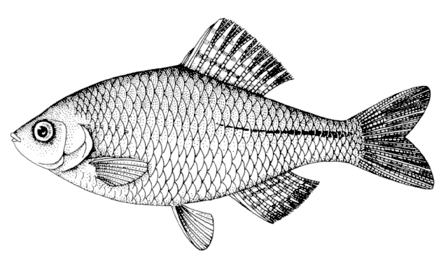
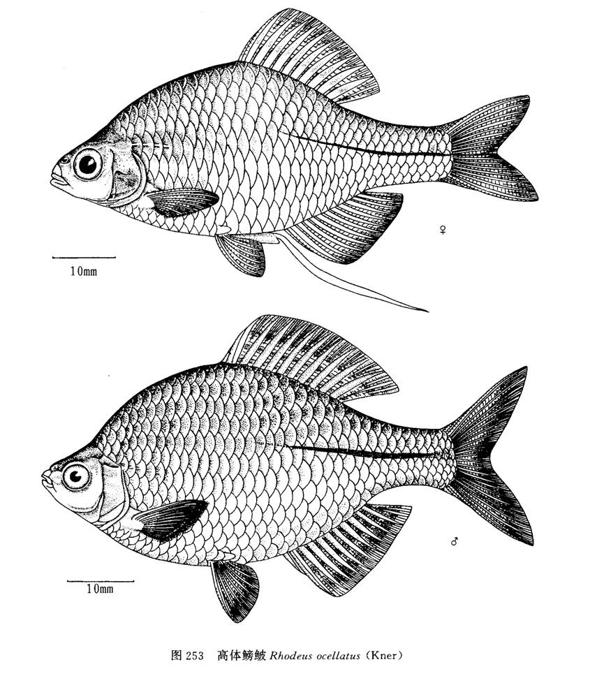
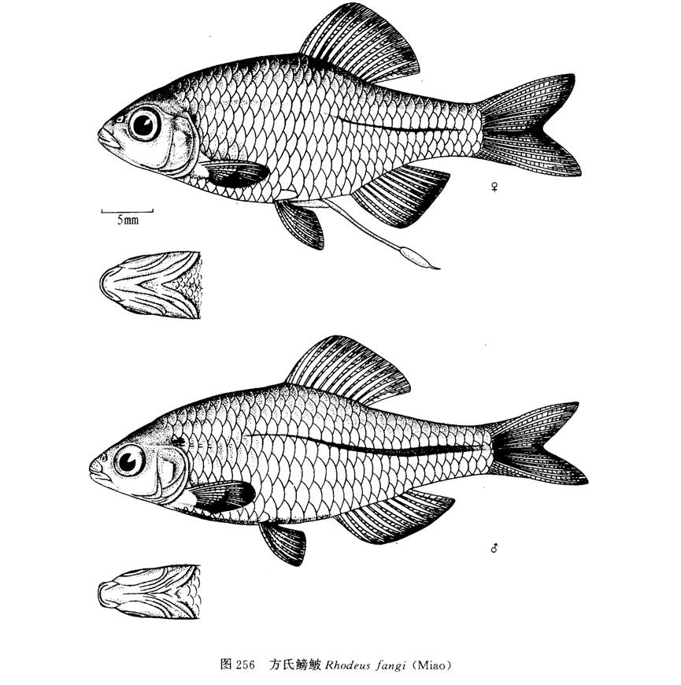
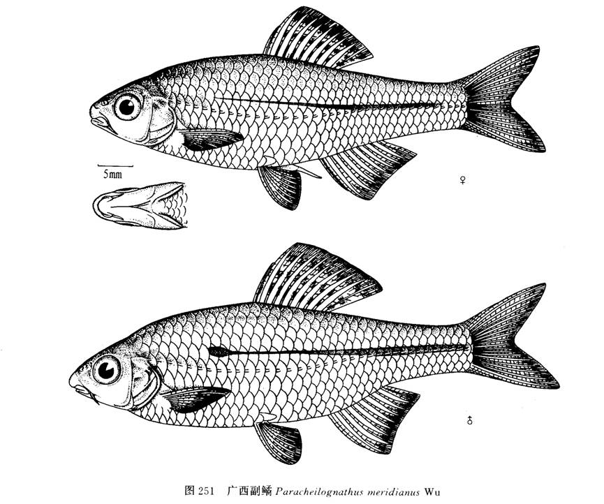
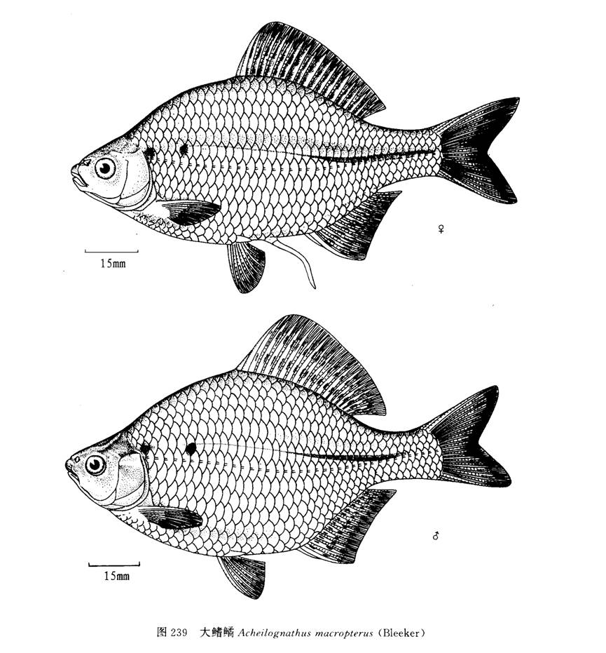
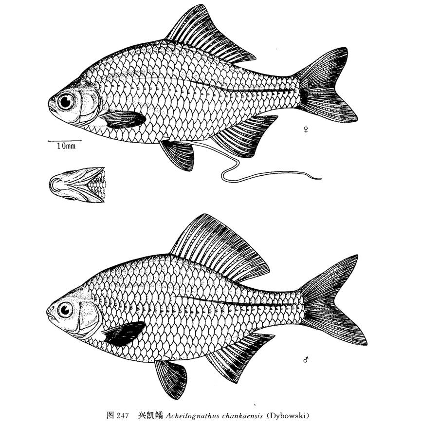
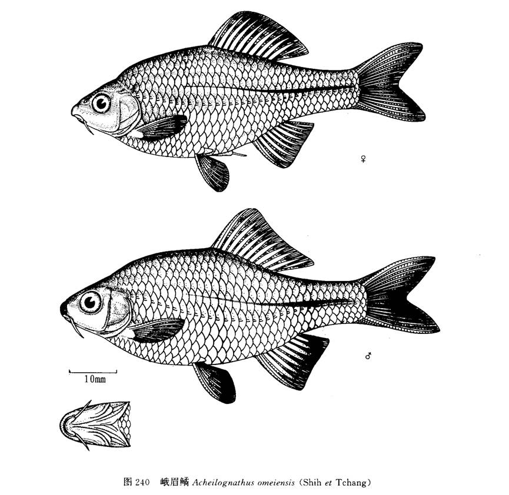
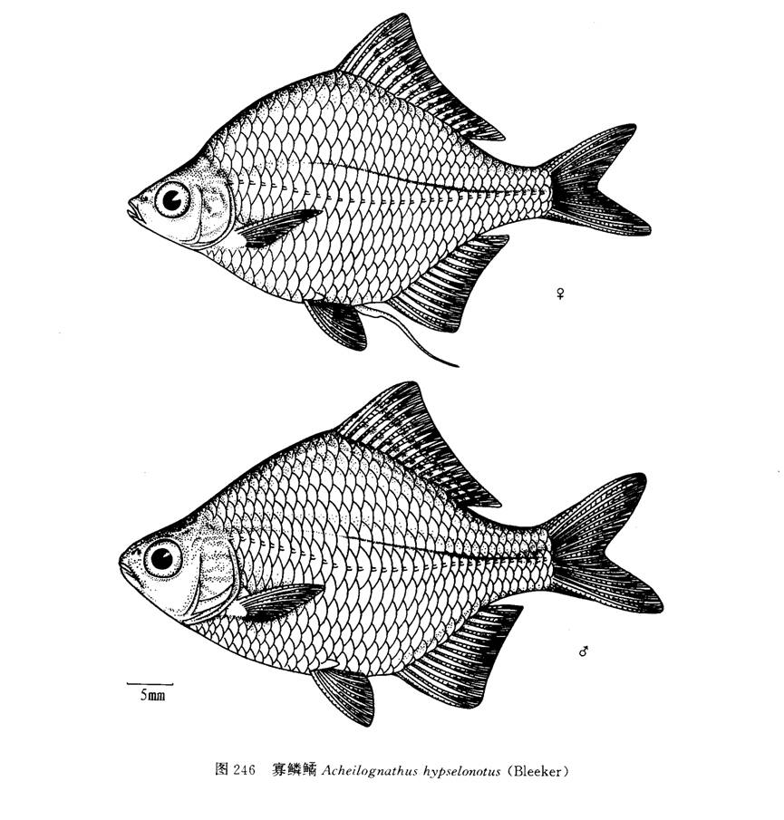
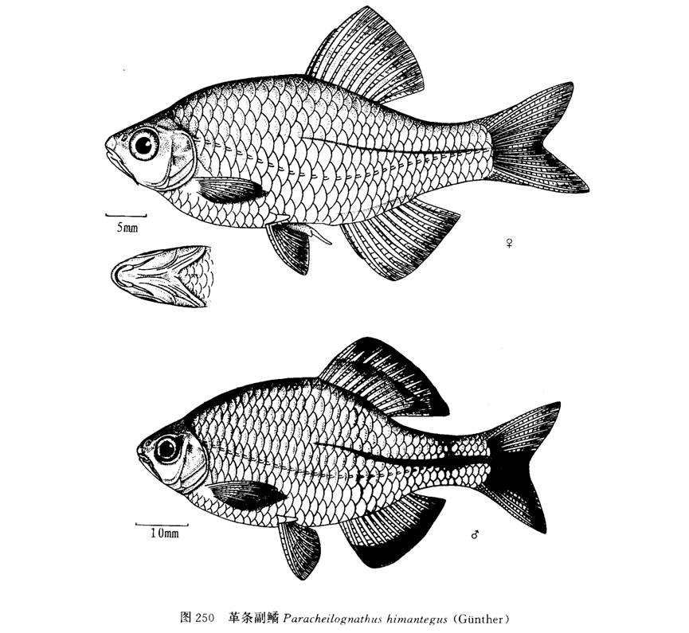

中国原生鱼：鳑鲏亚科鱼类
---

<!-- TOC -->

- [前言](#前言)
- [鳑鲏介绍](#鳑鲏介绍)
- [黑龙江鳑鲏](#黑龙江鳑鲏)
- [中华鳑鲏](#中华鳑鲏)
- [高体鳑鲏](#高体鳑鲏)
- [彩石鳑鲏](#彩石鳑鲏)
- [方氏鳑鲏](#方氏鳑鲏)
- [刺鳍鳑鲏](#刺鳍鳑鲏)
- [无须鱊](#无须鱊)
- [须鱊](#须鱊)
- [短须鱊](#短须鱊)
- [彩鱊](#彩鱊)
- [广西鱊](#广西鱊)
- [大鳍鱊](#大鳍鱊)
- [越南鱊](#越南鱊)
- [兴凯鱊](#兴凯鱊)
- [白河鱊](#白河鱊)
- [峨眉鱊](#峨眉鱊)
- [长身鱊](#长身鱊)
- [斑条鱊](#斑条鱊)
- [寡鳞鱊](#寡鳞鱊)
- [巨口鱊](#巨口鱊)
- [多鳞鱊](#多鳞鱊)
- [革条田中鳑鲏](#革条田中鳑鲏)
- [其它鳑鲏](#其它鳑鲏)

<!-- /TOC -->

## 前言

本文链接：[https://github.com/mcxiaoke/biology](https://github.com/mcxiaoke/biology)

本文资料来自：

- [中国动物志数据库](http://www.zoology.csdb.cn/page/showTreeMap.vpage?uri=cnfauna.tableTaxa)
- [FishBase鱼类数据库](http://fishbase.org/search.php)

## 鳑鲏介绍 

鳑鲏亚科（Acheilognathinae）鱼类的总称。属硬骨鱼纲、鲤形目、鲤科。主要分为三属：鱊属（Acheilognathus），鳑鲏属（Rhodeus），田中鳑鲏属（Tanakia）。中下层小型淡水鱼类。分布于中国、朝鲜、日本等国内陆各水体中。体亚圆形或菱形，侧扁。口前下位，马蹄形，口角具须或无须。下咽齿1行，齿面平滑或带有锯纹，尖端钩状。侧线完全或不完全。背鳍基部较长，大部或部分与臀鳍基底相对。背鳍和臀鳍无硬刺或具光滑的硬刺，均具2～3不分支鳍条，7条以上分支鳍条。胸鳍狭长，下侧位。

主要分布于亚洲东部中国、朝鲜及日本。我国有3属21种，除西北地区及许多内陆河湖外，几遍及各江湖。为小型淡水鱼类，最大不过18厘米。

大多数鳑鲏，如大鳍鱊、兴凯鱊等生活于平原地区，喜栖息于近岸水草丛中或江湖流水中。黑龙江鳑鲏（R.sericeus）、彩副鱊、彩石鳑鲏等多栖息于小水面静水湾或水塘中。另一些种类，如广西副鱊（P.me-ridianus）、革条副鱊、峨眉鱊（A.ometensis）则栖于山间溪流中。鳑鲏为草食性鱼类，主要摄食藻类及高等植物碎屑，也偶食浮游动物及水生昆虫。鳑鲏最大年龄可达5龄，一般第一次性成熟年龄为1～3龄。生殖期间雄鱼呈现出婚姻色。如雄鱼的背鳍及臀鳍鳍条的延长，吻部和眼眶周围出现明显的珠星、鲜艳的婚姻色彩等。雌鱼具一条长的产卵管，卵由产卵管排于河蚌的鳃水管内或外套腔中，直至发育成幼鱼才离开蚌体，生殖季节过后，产卵管萎缩。大鳍鱊的卵椭圆形。卵粒大。鱼体长约8厘米，体重约18克，怀卵量约为600粒。繁殖期4～6月。越南鱊卵椭圆形，怀卵量100余粒，繁殖期为4～6月。兴凯鱊卵椭圆形，怀卵量700余粒，繁殖期4～5月。高体鳑鲏卵椭圆形，卵径一般为2～3毫米。繁殖期在5～6月。大鳍鱊为这亚科中最大的一种，体长一般为110毫米，最大体长不超过180毫米，体重50克左右。一般作畜禽饲料，也可食用。

## 黑龙江鳑鲏

Rhodeus sericeus  (Pallas, 1776)

http://www.fishbase.org/summary/2948

又名丝鳑鲏、葫芦籽。

体侧扁而延长，似纺锤形，体厚不及体高1/3，背缘较腹缘稍外突。头较长，显著长于头高，为体高的2/3；尾柄细长。口亚下位，口顶端处于眼下缘水平线上，偶尔可移至瞳孔水平线上；口裂呈浅弧形，口角间距大于口角间距中点至下颌顶端距离（约3:2),上下唇相连处的外缘位于眼下缘水平线之下。口角无须。眼较大，大于吻长，侧上位。眼间较平，间距大于眼径。鳃孔上角位于眼上缘水平线之下。鳃盖膜至鳃盖骨前缘与峡部相连。

背、臀鳍末根不分枝鳍条硬，但细如首根分枝鳍条，不分枝的第二根约有首根长的2/3。背鳍位于吻端和尾鳍基之间或较近后者。臀鳍位于背鳍之下方，其起点约与背鳍第五或第六分枝鳍条相对，臀鳍基底长短于尾柄长。腹鳍位于背鳍之前下方，相距约1—2鳞片，亦介于胸鳍基和臀鳍起点之间或稍近后者。胸鳍末端不达腹鳍起点，相距2—3鳞片。肛门位于腹鳍基和臀鳍起点之间或稍近前者。尾鳍叉形。

侧线不完全；背鳍前鳞呈棱状超半数。下咽骨呈弧形，齿细长，侧扁，齿侧光滑或具隐约凹纹，咀嚼面狭窄略凹，末端钩状。鳃耙短，约有最长鳃丝的1/4，呈三角形，排列较密。鳔2室，前室长度只有后室1/2。

固定标本尾柄黑纵条向前延伸不超过背鳍起点。背、臀鳍间膜具有不连续黑点，组成2-3列纵条。繁殖季节雄鱼的背、臀鳍和胸鳍均延长；吻部具珠星；臀鳍外缘黑色，其宽约为最长鳍条的1/5—1/3。

分布于我国的黑龙江流域及欧洲。

## 中华鳑鲏

Rhodeus sinensis  Günther, 1868

http://www.fishbase.org/summary/54926

体侧扁，卵圆形。口小，端位，下颌稍短于上颌。无须。第三块下眼眶骨的宽度大于眼径的1/2，背鳍和臀鳍的最后一枚不分枝鳍条基部较强硬，末端柔软。背鳍起点位于身体中部，略近最后鳞片。臀鳍起点和背鳍条第四枚分枝鳍条相对。侧线鳞不完全，侧线鳞3～7片。腹膜灰黑色。鳔两室，后室较前室大。体侧上部每个鳞片后缘都有小黑点。自最后第三个侧鳞开始沿尾柄中线有一条黑色的纵纹，向前直延伸至臀鳍起点的正上方。鳃孔后方第一个侧线鳞及第四、五个侧鳞上均有一个很不明显的黑斑。

生殖季节雄鱼的吻端左右侧各有一丛白色珠星，眼眶上缘也有珠星。眼球上半部红色。臀鳍浅红色，镶一条较狭的黑边。腹鳍前缘白色，背鳍具两列白色的斑点。前上缘红色，后缘黑色。尾鳍中部具红色纵纹。雌鱼具长的产卵管。背鳍前部有一个大黑点。尾柄上的纵纹比雄鱼的为细。雌鱼的个体一般比雄鱼小。

长江流域的中华鳑鲏，开始性成熟的雄鱼标准长为30毫米左右。繁殖期在5月间。幼鱼背鳍前部有一大黑点。个体小，最大个体的标准长不超过45毫米。主要食物为藻类。

分布于河北、天津、山西、长江流域以南。

## 高体鳑鲏

Rhodeus ocellatus  (Kner, 1866)

http://www.fishbase.org/summary/4784

又名济南鳑鲏。

体高，呈卵圆形，侧扁，头后背缘格外隆起，尾柄短而高，其高常超过其长的1/20头小，头长约等于其高，不及体高的1/2。吻短而钝，其长短于眼径。口端位，口裂呈弧形，口顶端约在眼中点水平线上，口角位于眼下缘水平线之上，止于鼻孔前缘，两口角间距约等于口角间距中点至下颌顶端距离。口角无须。眼侧上位。鳃孔上角略低于眼上缘水平线。鳃盖膜联于峡部。

背、臀鳍末根不分枝鳍条稍硬，与各自首根分枝鳍条粗细相当，不分枝鳍条的第二根约为首根2/3长。背鳍起点于吻端和尾鳍基之间或略有前后。背鳍基底较长，大多数个体长于背鳍基底末至尾鳍基距离（体长在60mm以下，则等长）。臀鳍位于背鳍之下方，其基底长于或相当于尾柄长。腹鳍位于背鳍之前，腹鳍基部和背鳍起点在同一垂直线（雌鱼）或稍有距离（雄鱼），并且位近臀鳍起点较之胸鳍基部，偶有介于二者之中。胸鳍末端超过或将及腹鳍起点者为雄鱼，不及的是雌鱼。尾鳍叉形。肛门位于腹鳍基和臀鳍起点之间或近前者。

侧线不完全。背鳍前鳞呈棱状超过半数。下咽骨似弧形，齿细长，侧扁，咀嚼面细狭稍凹，末端钩状，齿侧光滑或偶有浅凹纹（在高倍镜检下）。鳃耙呈三角形，其长为鳃丝长的1/5—1/4。鳔2室，前室约有后室长的1/2。消化管长为体长的2.4—7.0倍。腹膜银白色布有黑点。

繁殖季节的雄鱼色彩绚丽，多色相互交辉，鳃盖上角之后有虹彩斑块，沿尾柄有纵 条虹彩衬托在银白色鱼体上闪闪发亮；另有红色点缀着眼虹膜的上半圈、背鳍的前外缘（限于末根不分枝鳍条和第一至第四分枝鳍条）、臀鳍及尾鳍（中央最短鳍条3—5根）；黑色镶着背鳍（约第五至第十根分枝鳍条）、臀鳍（限于分枝鳍条）外缘，鳞片的后缘，但位于体背部的较腹部密集，故体色呈现背较腹部深；乳白色仅见于腹鳍不分枝鳍条上。雌鱼近金黄色，产卵管呈粉红色。珠星见于雄鱼吻端、眶上骨和泪骨，主要集中于吻端两 侧。

固定标本体为褐色，尾柄黑纵条明显，雄鱼粗于雌鱼，向前不超过背鳍起点，雄鱼在鳃盖上角之后有2个横列黑斑。背、臀鳍外缘为狭黑边。雌鱼产卵管呈灰色。

分布于澜沧江、珠江、海南岛、韩江、长江、黄河等水系。

## 彩石鳑鲏

Rhodeus lighti  (Wu, 1931)

http://www.fishbase.org/summary/47833

体似卵圆形，侧扁而高，尾柄高度随体长增加而增高，体长达40—50mm时尾柄高和长相当。头短，头长往往大于头高。吻短而钝，其长不及眼径。眼侧上位，眼间呈弧形。鼻孔位近眼前缘较之吻端。口端位，口顶的水平线可穿过瞳孔，口裂较深，口角水 平线在眼下缘水平线之下。口角无须。鳃孔上角低于眼上缘水平线。鳃盖膜与峡部相连。

背、臀鳍不分枝鳍条细如首根分枝鳍条，不分枝鳍条第二根约有末根的2/3—1/2长。背鳍起点距尾鳍基较距吻端为近，偶有介于二者之间。背鳍基底长短于背鳍基底末至尾鳍基距离，偶有等长。臀鳍位于背鳍之下方，其基底长相当于或大于尾柄长。腹鳍位于背鳍之前下方，介于胸鳍基部和臀鳍起点之间或稍近前者。肛门位于腹鳍基部和臀鳍起点之间。尾鳍叉形，较浅，中间最短鳍条长约为最长鳍条长的1/2。

侧线不完全。背鳍前鳞多数呈棱状；腹鳍腋鳞较明显，约有腹鳍最长鳍条的1/4-1/3。下咽齿齿侧常有凹纹，咀嚼面狭而略凹，齿端呈钩状。鳃耙短，似三角形，排列稀疏。鳔2室，前室短，近椭圆形，后室长，为前室的2倍。消化管较短，约为体长的1.2—1.6倍。

固定标本尾柄黑纵条向前不超过背鳍起点，雄鱼较雌鱼粗，其宽度约有半个鳞片。雄鱼鳃盖上角有1小黑圆点，约隔2—3鳞片有形如长棒垂直而列的黑斑。雄鱼臀鳍外镶黑宽边，其宽度约有首根分枝鳍条长的1/6—1/5。雌鱼产卵管呈灰黑色，从基部至末端由深而浅。雌鱼体长约40mm，其背鳍（限于末根不分枝鳍条和3-4分枝鳍条及间膜）近基部仍有黑斑。

栖息于水流缓慢、水草茂盛的水湾处或静水塘及溪流中。喜群游。食物为水草、附着藻类、沉淀有机物、水生昆虫及枝角类。个体小，最大个体的标准长不超过50毫米。

分布很广，自我国南部的福建、广东，直至东北的黑龙江流域，均甚丰盛。

## 方氏鳑鲏

Rhodeus fangi  (Miao, 1934)

http://www.fishbase.org/summary/55889

体似纺锤形，侧扁，背鳍起点处为体最高点。头小，其长大于头高。口端位，口裂呈弧形，口角止于鼻孔前缘，口角间距相当于口角间距中点至下颌顶端的距离。口角无须。眼侧上位，其长大于吻长。眼间略隆起。鳃孔上角在眼上缘水平线之下。鳃盖膜至鳃盖骨前缘与峡部相联。

背、臀鳍末根不分枝鳍条较首根分枝鳍条硬，第二根不分枝鳍条约为首根的1/2-2/3长。背鳍起点位居吻端和尾鳍基之中或略近后者，背鳍基底长短于背鳍基底末至尾鳍基距离或几等长。臀鳍起于背鳍倒数第3—4分枝鳍条之下，臀鳍基底长度短于尾柄长或几等长。腹鳍位于背鳍起点之前，腹鳍基底与背鳍起点相对或相距1-2鳞片，亦介于胸鳍基部和臀鳍起点之间。胸鳍末端超过或将及腹鳍起点。尾鳍叉形。

侧线不完全。背鳍前鳞呈棱状不超过半数。腹鳍基部腋鳞较发达。鳃耙短，仅有最长鳃丝的1/6—1/5，排列稀疏。鳔2室，前室短，后室长。其长约有前室2倍。消化管长为体长1.0-2.3倍。

固定标本的尾柄黑纵条均超过背鳍起点，一般雄鱼较雌鱼粗，最粗处约跨2纵列鳞片的各半片；鳃盖上角雄鱼常有一圆形小黑斑，雌鱼背鳍前方常具一小黑斑。雌鱼产卵管和雄鱼吻端、泪骨的珠星以及雄鱼臀鳍外缘黑边均见于繁殖季节。

分布于珠江、长江、黄河、黑龙江等水系。

## 刺鳍鳑鲏

Rhodeus spinalis  Oshima, 1926

http://www.fishbase.org/summary/54927

体侧扁，卵圆形，背缘比腹缘薄而隆起。头小，锥状。口端位，口裂呈浅弧形，口顶点约与眼中点相对，口角末端止于眼前缘之前，口角间距几等于间距中点至下颌顶端距离。口角无须。眼侧上位。鼻孔位近眼前缘较至吻端。鳃孔上角略低于眼上缘水平线。鳃盖膜联于峡部。

背、臀鳍末根不分枝鳍条基部硬，末端软，后缘光滑，其粗细相当于各自首根分枝鳍条。背鳍位于体中点。臀鳍起于背鳍的第三或第四分枝鳍条的下方。背、臀鳍基底较长，背鳍基长于背鳍基末至尾鳍间的距离；臀鳍基长于尾柄长。腹鳍位于背鳍的前下方，通常雄鱼前于雌鱼，腹鳍基部和背鳍起点之间相距约2个鳞片。胸鳍末端将达腹鳍起点。肛门位于腹鳍基部和臀鳍起点之间或稍近前者。尾鳍叉形。

侧线不完全。背鳍前鳞几乎全部呈嵴状。下咽齿侧扁，细长，其咀嚼面狭窄，略凹，齿侧光滑或有凹纹。鳃耙短突状，排列稀疏。鳔2室，前室短，呈椭圆形，后室长，成倍长于前室。消化管为体长的6.4倍。 

固定标本体背部灰黑色，腹部灰白。尾柄具黑色纵条，向前不超过背鳍起点；鳃盖后方具2块平列的黑斑；雄鱼臀鳍外缘有极狭的黑边，雌鱼无色。

分布于珠江、海南岛、元江等水系。

## 无须鱊

Acheilognathus gracilis  Nichols, 1926

http://www.fishbase.org/summary/54711

体侧扁，似长纺锤形。头短钝，头高接近头长，不及体高。吻短于眼。眼侧上位。口亚下位，口顶与眼下缘在同一水平线上，口裂呈浅弧形。口角无须。鳃孔上角低于眼上缘水平线。鳃盖膜至鳃盖骨前缘和峡部相连。侧线完全，行至腹鳍至臀鳍对应处稍下弯，伸人尾柄中央。

背、臀鳍末根不分支鳍条粗于各自首根分支鳍条，第二根不分支鳍条较短，约占末根不分支鳍条的1/5—1/3。背鳍起点在吻端和尾鳍基之中或近前者。臀鳍起点与背鳍基后部对应。背鳍基长短于背鳍基末至尾鳍基距离。臀鳍基长短于尾柄长。腹鳍始于背鳍之前。肛门位于腹鳍基和臀鳍起点之间。尾鳍浅分叉，最短的中央鳍条占最长外侧鳍条的2/3。

下咽骨似弧形，各齿细长侧扁，齿侧平或有隐约凹纹，咀嚼面窄，末端带钩状。鳃耙排列较密集。鳔分2室，前短后长。消化管为体长的6倍。

固定标本的雄鱼臀鳍有一纵黑带，其外缘无色。分布于长江水系。

## 须鱊

Acheilognathus barbatus  Nichols, 1926

http://www.fishbase.org/summary/55891

体侧扁，近卵圆形，体高约为体宽（头后躯部最大左右侧距）2.8倍，未超过3倍。头较短，头长和头高几相近。吻短钝，通常接近眼径或稍小。口小，亚下位，口顶约在瞳孔下缘水平线上，上颌末端不达眼前缘，亦在眼下缘水平线之下，口裂浅弧形，两口角间距相等或略大于两口角间距中点至上领顶端距离，下唇较上唇肥厚，上下唇联于口角。口角须1对，约有眼径长。眼侧上位。眼间较宽凸。鳃孔上角位在眼上缘水平线之下。鳃盖膜在鳃盖骨前缘下方连于峡部。侧线完全，行至与腹鳍对应处略下弯，继人尾中央。
背、臀鳍末根不分枝鳍条比各自首根分枝鳍条稍粗硬，背鳍起点雄鱼在吻端和尾鳍基之间，雌鱼近尾鳍基较之吻端。背鳍基底长不超过从背鳍基末至尾柄末片鳞的距离。臀鳍基底长于尾柄长，臀鳍起点约与背鳍第七分枝鳍条（雌鱼）或第五（雄鱼）相对应。腹鳍位于背鳍之前下方，腹鳍基部与背鳍起点相距2鳞片或少些，亦在胸鳍基部与臀鳍起点之间。胸鳍和腹鳍约等长，胸鳍末端不达腹鳍，相距1—2鳞片。肛门约在腹鳍基部和臀鳍起点之间。尾鳍分叉较浅，最长分枝鳍条约为中央最短鳍条的2倍。

下咽骨似弧形，咽齿长而侧扁，齿侧缘有凹纹或平滑。背鳍前鳞不及1/2呈棱状。鳔2室，前短后长。消化管长约为体长的4.4—5.6倍。

固定标本体色灰黑，侧线以上色较深。鳃盖上角有一小黑斑。沿尾柄中央有一黑纵条，向前止于背鳍基中点之下方，其粗细往往随性别而异。雄鱼的臀鳍外缘无色，约占最长鳍条1/4，而从臀鳍基部至无色外缘之间的鳍条和间膜密集黑色素；背鳍外缘亦无色，但明显狭于臀鳍。

分布于长江和闽江等水系。

## 短须鱊

Acheilognathus barbatulus  Günther, 1873

http://www.fishbase.org/summary/54928

体侧扁，略延长，背缘薄而稍突起，腹缘圆而平直，体厚（近鳃盖上角躯部左右侧距离）不及体高的3倍。口狭小，亚下位，口裂如半月形，两口角间距大于或相当于两口角间距中点至上颌顶端的距离。上颌末端在鼻孔前缘的下方。上下唇联于口角，口角有对短须或缺。眼侧上位。鼻孔位近眼前上缘较之吻端。鳃孔上角处在眼上缘水平线之 下。鳃盖膜至鳃盖骨前缘和峡部相连。侧线完全，走向较为平直。

背、臀鳍末根不分枝鳍条粗于各自首根分枝鳍条。背鳍位于吻端和尾柄基之间或略近后者。背鳍基底长于背鳍基末至尾柄基距离。臀鳍起点与背鳍第五一六分枝鳍条相对，臀鳍基底略长于尾柄长。腹鳍位于背鳍之前下方，腹鳍基部和背鳍起点往往在同一垂直线上，亦处于胸鳍基部和臀鳍起点之间，或稍近后者。肛门位于腹鳍基部和臀鳍起点之间或近前者。尾鳍叉形。

下咽齿侧缘或光滑或具凹纹，凹纹有深有浅。背鳍前鳞呈棱状约占半数或不及。鳔分2室，后室长约有前室2倍。消化管约有体长的2.1—4.3倍，消化管随体长增加而增长。腹膜黑褐色。

固定标本近鳃盖上角有一小黑斑，跨越2—3个鳞片。沿尾柄的黑纵条较细，向头方延伸不超过背鳍之起点。背鳍外缘有狭黑边；臀鳍外缘无色，但雄鱼臀鳍近外缘有1纵黑条，其粗细约占最长鳍条1/3。

分布于长江中下游及福建、山东等地。分布于澜沧江、珠江、长江、黄河等水系。

## 彩鱊

Acheilognathus imberbis  Günther, 1868

http://www.fishbase.se/summary/55887

旧称彩副鱊。

体侧扁，似纺锤形。头较长，头长大于头高。吻稍钝。口端位，口裂略斜，约止于鼻孔前缘的下方，上颌末端与眼下缘在同一水平线。口角无须，或有短突状须，最长亦不超过眼虹膜径。鼻孔位近眼前上缘较之吻端。鳃孔上角约在眼上缘水平线之下。侧线完全，较平直，后人尾柄中央。

背、臀鳍的末根不分枝鳍条同各自首根分枝鳍条等大，第二根不分枝鳍条较长，稍短或相当于末根不分枝鳍条。背鳍起点距吻端比距尾鳍基稍近。臀鳍起点约与背鳍基中点相对。胸鳍末端与腹鳍起点相距2—3鳞片。腹鳍和背鳍相对，起点距臀鳍起点比距胸鳍基部为近，肛门位于腹鳍基部和臀鳍起点之间。尾鳍分叉较深。

背鳍前鳞半数以上呈棱形。下咽齿侧缘无凹纹。鳃耙短，呈片状，排列稀。鳔2室，前室短，不及后室1/2长。消化管较短，为体长的1.4—2.0倍。

固定标本的尾柄黑纵条向前延伸超过背鳍起点，与侧线上下并列。雄鱼臀鳍外缘无色，约有最长鳍条1/4—1/3宽。

分布于长江水系、黄河水系各支流。

## 广西鱊

Acheilognathus meridianus  (Wu, 1939)

http://www.fishbase.org/summary/56321

旧称广西副鱊。

体延长而侧扁。头如锥状，头长超过头高。吻钝，吻长与眼径相当。鼻孔位近眼前上缘较之吻端。眼间距大于眼径并略突出。眼侧前上位。口亚下位，口裂呈马蹄形，上颌末端处于眼下缘水平线之下。1对口角须，长约眼径的1/4-1/2。侧线完全，较平直，后人尾柄中线。
背、臀鳍末根不分支鳍条较细，相当于各自首根分支鳍条；背鳍的第二根不分支鳍条约有首根不分支鳍条一半长。背鳍起点距吻端较距尾鳍基为近，或居两者中点。臀鳍起点与背鳍倒数的第二至第三（雌鱼）或第三至第四（雄鱼）分枝鳍条相对。背鳍基长，长于臀鳍基，臀鳍基长短于尾柄长。腹鳍和背鳍起点在同一垂直线上或腹鳍稍前，距臀鳍起点较距胸鳍基底为近。胸鳍末端和腹鳍起点相距2—4鳞片。肛门约位于腹鳍基和臀鳍起点之间或略前移。尾鳍分叉。
背鳍前鳞仅3—4鳞片呈棱脊状。下咽骨近弧形，下咽齿较长而侧扁，齿侧缘光滑或有极浅凹纹。鳃耙短，呈片状，排列稀疏。鳔分二室，前室长不及后室之半。消化管为体长的2.2—4.0倍。
生殖期雄鱼的婚姻色最为鲜艳，体上半部蓝绿色，下半部近浅红色，沿尾柄呈现金黄色并具蓝宝石虹彩条纹，而且向前延伸越过背鳍起点。背鳍外缘镶有狭细黑边；臀鳍外缘为红边；腹鳍和尾鳍呈黄色。固定后沿尾柄虹彩条纹转呈纵黑条，雄鱼向前延伸部有圆形或椭圆形小黑斑块，雌鱼则黑纵条较细而不明显．且前方亦无黑斑块。雄鱼背鳍外缘仍有狭黑边，臀鳍外缘的红色变为无色。

分布于珠江水系。

## 大鳍鱊

Acheilognathus macropterus  (Bleeker, 1871)

http://www.fishbase.org/summary/54380

体侧扁，背缘较腹缘隆起。头短小，其长不及体高。口亚下位，口的顶点水平线远在眼下缘之下，口裂浅，两口角间距和两口角间距中点至下领顶端距离几等长。口角须1对，突起状，或缺失。鼻孔位近眼前缘较之吻端。眼侧上位。鳃孔上角稍低于眼上缘水平线。鳃盖膜至鳃盖骨前缘下方连于峡部。侧线完全，或尾部倒数1—4鳞片无孔，平直，后人尾柄中央。

背鳍位居体中央，或略近吻端较之尾鳍基。臀鳍起点与背鳍基中点相对。背、臀鳍末根不分枝鳍条粗壮，末端分节。背鳍基底长于臀鳍基底，后者长于尾柄长。腹鳍位在背鳍之前，腹鳍基部和背鳍起点往往在同一垂直线上，或略重叠。肛门位于腹鳍基和臀鳍起点之间。尾鳍叉形，末端尖。

下咽骨近弧形，齿侧扁，大多数齿侧有深凹纹，亦有光滑，咀嚼面狭，末端钩状。鳃耙较短，最长的鳃耙约有最长鳃丝的1/4。鳔2室，前短后长。消化管约为体长的3—4倍。腹膜黑褐色。

繁殖期雄鱼婚姻色明显，沿尾柄有蓝宝色纵条。鳃盖后缘蓝绿色的斑块，外围浅红色。各鳍呈浅柠檬色并夹带浅红色。虹膜、尾基部均为红色。雄鱼吻端和泪骨上追星为乳白色。液浸标本尾部有明显的黑纵条；鳃盖后缘黑斑及背、臀鳍的黑纵条亦为明显。雌体产卵管为无色。

常栖居于水草丛生处。主要以高等植物的叶片、浮游及着生藻类为食，较大的个体也摄食动物性食料，标准长100毫米以上的个体甚至也捕食其它小型鱼类的幼鱼。

本种分布较为广泛，有海南岛的南渡江、万泉河、珠江、长江、黄河、图们江和黑龙江等水系。

## 越南鱊

Acheilognathus tonkinensis  (Vaillant, 1892)

http://www.fishbase.org/summary/54709

体高而侧扁，头后背部特隆起，背缘薄，腹缘厚而平直。头似锥形，头长大于头高，但不及体高。口亚下位，口顶水平线在眼下缘之上，上颌末端在眼下缘之下，口呈弧形，两口角间距长于口角间距中点至下颌顶端距离。有口角须，其长约为眼径的1/2或更短。 

眼侧上位。眼间略凸。鳃孔上角在眼上缘水平线之下。鳃盖膜联于峡部。侧线完全，行于体中轴。
背、臀鳍末根不分枝鳍条粗于各自首根分枝鳍条，末端分节。背鳍起点约在吻端和尾鳍基之间，或近吻端。背鳍基长往往长于从背鳍基末至尾鳍基距离，偶尔等长。臀鳍走点和背鳍第四至第六根分枝鳍条相对，臀鳍基长于尾柄长或等长。腹鳍基部和背鳍起点在一个垂直线上或略有重叠，亦位于胸鳍基和臀鳍起点之间。肛门位于腹鳍基和臀鳍走点之间或近前者。尾鳍分叉，最长鳍条约为中央最短鳍条的2倍。

下咽骨近弧形，咽齿侧扁、细长，多数齿侧有深凹纹，个别无，咀嚼面狭，齿端带钩。鳃耙短，约为最长鳃丝的1/4长。鳔2室，前室短，不及后室之半。消化管约为体长的3.3—5.5倍。腹膜黑褐色。

种群个体的大小似乎与性别有关，往往雌鱼小于雄鱼。两性个体的背鳍和臀鳍均呈现黑白相间的纵条纹。雄鱼除了繁殖期具珠星外，在婚姻色上雄鱼较雌鱼更为鲜艳，如在虹膜、背鳍和臀鳍前几根分枝鳍条之末端及尾鳍基部布有红色斑点。雌雄体腹鳍带黄色，雄鱼又夹有红色。尾柄中轴呈现有隐约蓝宝绿色纵条，向头方伸延，但未与近鳃盖上角的黑斑相连。

分布于元江、珠江、海南岛的万泉河、闽江、 瓯江、长江、淮河水系和黄河等水系。

## 兴凯鱊

Acanthorhodeus chankaensis  (Dybowski, 1872)

http://www.fishbase.org/summary/46831

体侧扁．短而高．体宽不及体高的1/3头小，头长几等于头高。吻短钝。从鼻孔前缘至吻端往往较至眼前缘为近极少数个体介于二者之中。口端位，口裂极浅，口角左右间距显著大于间中点距中点至下颌顶端距离。口角与眼下缘处在同一水平线上。一般口角无须，偶有须短如突起、或成双或单个。鳃孔上角接近眼上缘水平线。鳃盖膜至鳃盖骨前缘下方连于峡部．侧线完全，沿体中线至尾柄中央。

背、臀鳍末根不分枝鳍条较粗于各自首根分枝鳍条；第二根不分枝鳍条较短，约为末根不分枝条长的1/3—1/2。背鳍位于体中央，或前后稍有移动。前移的多半是雌鱼，向后移的多半是雄鱼。臀鳍起点和背鳍第五一六分枝鳍条相对。腹鳍位于背鳍前下方，起点在胸鳍基和臀鳍起点之间或近后者。腹鳍末端达臀鳍（雄鱼）或相距1鳞片（雌鱼）。胸鳍末端触及腹鳍（雄鱼）或相距2鳞片（雌鱼）。肛门位于腹鳍基和臀鳍起点之间。尾鳍浅分叉，上下叶等长。

背鳍前鳞呈棱脊的占1/2。下咽骨似弧形．咽齿侧扁，齿侧具凹纹，个别齿光滑。鳃耙短，排列密，其长约为最长鳃丝的1/4—1/3。鳔2室，前短后长。消化管长约为体长的5.9—6.5倍。

固定标本沿尾柄黑纵条向前止于背鳍起点之下。雄鱼臀鳍外缘有宽黑边，黑边宽约占最长鳍条1/3。背、臀鳍第二不分枝鳍条末端黑色。

生活于江河、沟渠和池塘的缓流及静水浅水处。摄食硅藻、蓝藻和丝状藻类等。背鳍和臀鳍有两列黑色小斑点。腹鳍和臀鳍为黄白色，雄鱼臀鳍外缘镶有较宽的深黑色饰边。雌鱼臀鳍无黑边。繁殖期间雄鱼体色艳丽，吻端具白色珠星，鳍条上的斑点更为明亮；雌鱼具一灰色产卵管，产卵于蚌类的鳃瓣中。

分布于长江、珠江、韩江、黄河、黑龙江等水系。

## 白河鱊

Acheilognathus peihoensis  (Fowler, 1910)

http://www.fishbase.org/summary/61918

体侧扁，外形近卵圆形。口端下位，上颌稍比下颌长。眼侧位，眼径大于吻长，眼间距比眼径大。背鳍及臀鳍具硬刺。背鳍起点位于吻端至最后鳞片的中点。臀鳍起点与背鳍第6枚分枝鳍条相对。鳔两室。腹膜黑色。

鳃孔后方第一个侧鳞上有一个大黑点。沿尾柄有一条黑色纵纹，向前直延伸至背鳍基部中点下方。雄鱼的臀鳍有两列小黑点，边缘无色。背鳍有两列小黑点，边缘黑色。生殖期吻端有白色珠星。雌鱼臀鳍灰黑色，没有明显的有规则的斑点。背鳍有两列小黑点，前部有一黑色大斑点。生殖期具灰黑色产卵管。

外形与兴凯鱊极为类似，但两种鱼在鳃耙、鳍条色彩及产卵管的颜色上有差别。

生活于河流缓流或湖泊静水的浅水区域。以植物碎屑和藻类为食。在产卵期间，雄鱼吻端具白色珠星，雌鱼具灰黑色产卵管。分布于我国天津和江苏。

## 峨眉鱊

Acheilognathus omeiensis  (Shih & Tchang, 1934)

http://www.fishbase.org/summary/55890

体侧扁，纺锤形，背部略隆起，腹部圆。头短钝，头高不及头长，头长超过体高的一半。口亚下位，口裂浅，止于鼻孔之下。吻皮略下垂，并止于上唇基部。有对较宽扁相当眼径长的口角须。眼侧上位。眼间略突出。鼻孔近眼前缘。鳃孔上角在眼上缘水平线之下。鳃盖膜约至鳃盖骨前缘下方连于峡部。侧线完全，后行人尾柄中央。

背、臀鳍末根不分支鳍条较粗硬，第二根不分支鳍条（不包括分节部分）特短，只占末根的1/4—1/3。背鳍约位体中央。臀鳍起点约与背鳍基中点相对。腹鳍与背鳍相对，或稍前移。肛门近腹鳍基或在腹鳍基和臀鳍起点之间。尾鳍分叉。

下咽骨弧形。下咽齿侧缘除个别光滑余均有深凹纹，咀嚼面较窄，末端多为钩状。鳃耙排列稀疏，较短，最长约有鳃丝的1/4。鳔2室，前室短于后室。消化管细长，约为体长的3.4—5.2倍。腹膜浅灰色。
鲜活鱼体闪闪发亮，主色金黄，沿尾柄有条隐约的深蓝色纵条。雄鱼的臀鳍外缘呈无色亮边。边宽约有最长鳍条的1/3；腹鳍不分枝鳍条外侧和分枝鳍条末端为乳白色细边。固定标本沿尾柄蓝色纵条转为黑色，雄鱼尤为明显，雌鱼则较细；背鳍外缘有狭黑边。

产于四川峨眉山的溪流中。分布于长江水系上游。

## 长身鱊

Acheilognathus elongatus  (Regan, 1908)

http://www.fishbase.se/summary/9525

体长而侧扁，背部较薄，腹部较平直。头稍长，显著长于头高，约占体高的2/3。口亚上位，下颌比上颌略突出，稍上斜。口角无须。眼侧上位。鼻孔近眼前上角。眼间小于眼径。鳃孔上角接近于眼上缘水平线。鳃盖膜至鳃盖骨前缘下方连于峡部。方骨和下颌隅骨连接处突出。侧线完全、平直。

背、臀鳍末根不分支鳍条较粗，背鳍起点约在体中央。背鳍基底长于臀鳍基，后者长于或接近尾柄长。臀鳍起点与背鳍基中点相对。腹鳍在背鳍前下方，又介于胸鳍基和 臀鳍起点之间。胸鳍末端将达腹鳍。肛门位于腹鳍基和臀鳍起点之间。尾鳍深分叉，最长鳍条为最短鳍条2倍余。

下咽齿侧扁细长，侧缘具有多条深凹纹，咀嚼面稍凹而狭，齿端呈钩状。鳃耙排列较密，最长鳃耙约占最长鳃丝的1/3。鳔2室，前短后长。消化管较短，其长为体长的2.2—2.9倍。

固定标本沿尾柄的黑纵条前行超过背鳍基，但不明显。生殖期，雄鱼吻部有珠星外，近鳃盖上角有1小黑点，臀鳍外缘镶有阔黑边，边高占最长鳍条1/2。

分布于云南。已灭绝。

## 斑条鱊

Acheilognathus taenianalis  (Günther, 1873)

http://www.fishbase.org/summary/61857

体高而侧扁，背前部隆起较高，腹部呈弧形。头较小，吻尖。眼较大。侧线完全，较平直。背鳍和臀鳍均具硬刺。体背部灰褐色，腹侧银白色。鳃后方侧线鳞上方有一黑色大斑。尾柄中线具一条细长的黑色纵纹。背鳍、尾鳍有两列不连续的黑点，鳍的边缘黑色。其它各鳍浅灰色。生活习性和其它鰟鲏亚科类似。无经济价值。

生活于山涧溪流中，多在水流缓慢、水草丛生的浅水区域活动，摄食浮游植物、着生藻类和小型水生动物。广布于我国长江流域各省区和广西、福建。国外见于越南。

## 寡鳞鱊

http://www.fishbase.se/summary/55893

Acheilognathus hypselonotus  (Bleeker, 1871)

体似卵圆形，高而薄，体高常超过体长的1/2。头短，头长相当于头高，但不及体高1/2。尾柄亦短，大多接近尾柄高。吻钝。口端位，上下颌几等长，口裂浅，口裂长相当两口角间距。口角无须。眼侧上位。鼻孔位于吻端和眼前缘之间或近后者。眼间宽而平，大于或等于眼径。鳃孔上角偏高，几乎与眼上缘在同一水平线上。鳃盖膜未至鳃盖骨前缘下方即与峡部相连。侧线完全，中段略弯向腹面，后行尾柄中轴。

背、臀鳍末根不分枝鳍条较粗。背鳍起点距尾鳍基较距吻端为近或两者之中。背鳍基长，长于臀鳍基，后者长约为尾柄长的2倍。臀鳍起点与背鳍第三或四分支鳍条对应。腹鳍位于背鳍之前下方或部分对应。胸鳍末端越过腹鳍起点。肛门位近腹鳍基或介于它和臀鳍之间。尾鳍分叉，最短鳍条不及最长鳍条之半。

下咽齿侧扁，有的齿一侧具密集凹纹，有的平滑无凹纹，咀嚼面细狭，齿端钩状。鳃耙呈片状，最长鳃耙约占最长鳃丝的1/4—1/3。鳔2室，后室长为前室的1/2。消化管较细长．为体长的8—11倍。

生殖期雄鱼除吻部有珠星外，背、臀鳍鳍条皆延长，外缘皆镶黑边，背鳍黑边极狭，臀鳍黑边稍宽，约占最长鳍条的1/6。尾柄黑纵条较细，不及半个鳞片。

分布于长江中下游。这是一种极其美丽的鳑鲏，体高和体长的比例几乎为1：1。已灭绝。

## 巨口鱊

Acheilognathus tabira  Jordan & Thompson, 1914

http://www.fishbase.org/summary/22892

又名石副鱊、大口鱊。典型特征是口大、向上斜，是鳑鲏亚科鱼类中罕见的特征。

体侧扁延长。吻钝，吻长不及眼径。口端位，口裂较大。口角须1对，长为眼径的1/3—1/2。眼侧上位。眼间平，并大于眼径。鳃孔上角和眼上缘几乎在同一水平线上。鳃盖膜至前鳃盖骨前缘之下连于峡部。方骨和关节骨连接点明显外突。侧线完全，沿着体中轴，行至腹鳍处略下弯
背、臀鳍末根不分枝鳍条较粗壮，末端分节。背鳍起点位于吻端和尾鳍基之中或近吻端，臀鳍和背鳍部分对位。背鳍基长于臀鳍基；臀鳍基长相当于尾柄长。腹鳍位于背 鳍之前一下方。肛门在腹鳍基和臀鳍起点之间。尾鳍叉形，两叶等长，末端尖。

下咽骨似弧形；咽齿长而侧扁，侧缘有较深凹纹，咀嚼面细狭，略凹，齿端钩状。鳃耙细长，其长约为最长鳃丝的1/2。鳔2室，前短后长。消化管不及体长2倍。腹膜灰色，夹有稀疏黑点。

固定标本背、臀鳍的第二根不分枝鳍条及其后间膜呈黑色；背鳍分枝鳍条上有间断黑点共排成3行，至末端又有黑点连成细黑边；雌鱼臀鳍分枝鳍条及间膜无色，雄鱼除外缘外均有小黑点并由稀到密与无色外缘成明显对比。鳃盖上角之后，侧线之上约有2—4鳞片上有黑色斑块，雄鱼较大于雌鱼。尾柄黑纵条向前延伸不超过背鳍起点，雄鱼纵条较粗于雌鱼。

分布于江苏五里湖。国外盛产于日本。

## 多鳞鱊

Acheilognathus polylepis  (Wu, 1964)

http://www.fishbase.org/summary/55892

体侧扁而延长。头较长，其长大于头高。吻略尖。口亚下位．口顶约与眼下缘在同一水平线，口裂近弧形，两口角间距约等于两口角间距中点至下颌顶点的距离。口角须1对，其长不及瞳孔径。眼侧上位。鼻孔位近眼前上角较至吻端。鳃盖膜至鳃盖骨前缘下方连于峡部。鳃孔上角几乎和眼上缘处于同一水平线上。侧线完全，走向较平直。

背、臀鳍末根不分枝鳍条较粗硬，第二根不分枝鳍条长度约占末根的1/2。背鳍约位于体中央，背鳍基长长于臀鳍基。臀鳍和背鳍部分相对。腹鳍和背鳍起点几相对，或略前移，起点距臀鳍起点较至胸鳍基为近，其末端将达臀鳍起点。胸鳍末端和腹鳍起点相距2—3鳞片。肛门位近腹鳍基部较之臀鳍起点。尾鳍深分叉，中央最短鳍条约为最长鳍条的1/2。

下咽骨似弧形，咽齿侧扁细长，齿侧具深凹纹，个别齿无凹纹。鳃耙排列稀疏，最长鳃耙约为最长鳃丝的1/3。鳔2室，前室长约为后室1/2。腹膜灰黑色。背鳍前鳞呈棱状鳞达1/2。消化管长为体长的4.6倍。
生殖期雄鱼体色较雌鱼鲜艳，吻部有珠星。固定标本沿尾柄有1黑纵条，向前不超过背鳍起点之下，黑纵条粗细不一，雄鱼较雌鱼宽．约有半个鳞片宽。鳃孔上角有1黑斑，雄鱼较雌鱼显得清晰。

形态接近短须鱊及越南鱊，与前者的主要区别在于侧线鳞及鳃耙数较多，口须及肠管较长，眼较小等；与后者的主要区别在于侧线鳞数目较多，身体较长，臀鳍起点稍向后移，背鳍及臀鳍的刺较强硬，肠管较长，雄鱼的背鳍镶有黑边等。

主要食物为着生藻类，栖息于溪流中。分布于长江中下游及韩江。

## 革条田中鳑鲏

Tanakia himantegus  (Günther, 1868)

http://www.fishbase.org/summary/17290

旧称革条副鱊，又称台湾石鲋。

体高而侧扁，背、腹缘为弧形。头短小，头高将及头长。口近端位，口裂浅。呈弧形，上颌末端和眼下缘几乎在同一水平线。具1对较发达口角须，长达眼径的2/3以上或更长。眼侧上位。鳃孔上角稍低于眼上缘水平线。侧线完全，行至腹鳍和背鳍对应处弯向腹面，然后入尾柄中线。

背、臀鳍的末根不分枝鳍条同各自的首根分枝鳍条粗细相当，第二根不分枝鳍条为首根长的1/2。背鳍起点在吻端和尾鳍基之中点，或稍近后者。臀鳍起点约和背鳍倒数第三、四根分枝鳍条对位。腹鳍位于背鳍前下方．腹鳍基部和背鳍起点相距2-3鳞片。胸鳍末端未达或将达腹鳍。肛门位于腹鳍和臀鳍之间，或近前者。尾鳍分叉。 

背鳍前鳞有一半呈棱脊状。下咽骨近弧形，下咽齿长而侧扁，齿侧缘光滑，咀嚼面狭窄，齿端带钩状。鳃耙呈片状，排列稀疏。鳔2室，前短后长。消化管约为体长的6倍。

繁殖期雄鱼珠星布于吻端和泪骨区。固定标本的尾柄黑纵条在雄鱼粗于雌鱼。背、臀鳍外缘雄为弧形，雌为截形；雄鱼臀鳍外缘有黑色宽边，宽边约占最长鳍条的1/3—1/2,有的雄鱼外缘黑色宽边前方（近腹鳍）无黑色。尾鳍中央最短鳍条3—4根的鳍膜也呈黑色。

分布于台湾、福建、浙江等地。栖息于山涧溪流中。分布于九龙江、台湾浊水溪、长江水系。

## 其它鳑鲏

- 细鳞华鳑鲏 Sinorhodeus microlepis Li, 2017
- 白边鳑鲏 Rhodeus albomarginatus  Li & Arai, 2014
- 石台鳑鲏 Rhodeus shitaiensis  Li & Arai, 2011
- 阿氏鱊 Acheilognathus asmussii  (Dybowski, 1872)
- 斜方鱊 Acheilognathus rhombeus  (Temminck & Schlegel, 1846)