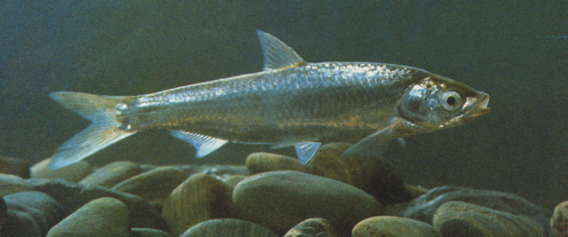
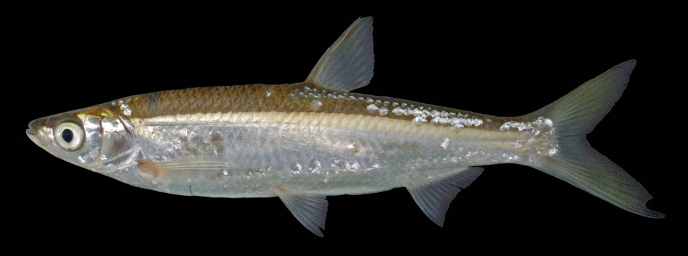

## 贝氏䱗

Hemiculter bleekeri  Warpachowski, 1888

CAFS:

<http://www.fishbase.org/summary/22529>

### 简介

又名小白条，贝氏餐。体型于餐略同，体侧扁，背腹缘略呈弧形，腹部自胸鳍基部下方至肛门具腹棱。头侧扁，头背平直，头长小于体高。体背部青灰色，体侧和腹面银白色，各鳍均为灰白色。在河流、湖泊、池塘等各类水体中都能生存，喜集群，常在浅水处摄食。杂食性鱼类。除西部高原外在各大水域均有分布。

### 形态特征

体长形，侧扁，头后背部稍突起，背部和胸部轮廓呈弧形。腹棱从胸鳍基部至肛门前存在。头短，略呈三角形。口端位，裂斜状，后伸达鼻孔后下方。吻短，其长度与眼径相当或较小。上下颌等长。眼大，位于头侧近前端。鼻孔位于眼前缘上方离眼前缘较近。鳃耙较短，排列较稀疏。下咽齿稍粗壮，基部呈圆柱形，末端尖，呈钩状。背鳍短小，外缘平截，最后一根不分枝鳍条为光滑硬刺，其长大于头长，其起点在腹鳍起点之前上方。胸鳍较小，末端尖，后伸不达腹鳍起点。腹鳍后伸不达肛门。臀鳍较短，外缘稍内凹。尾鳍分叉深，末端尖，下叶较上叶长。鳞片大，易脱落，腹鳍基部具腋鳞。侧线完全，在胸鳍上方逐渐向下弯曲，然后沿着腹部边缘向后伸延，至臀鳍基部后上方又向上弯曲，然后通过尾柄中轴向后延伸。身体背部青灰色，体侧和腹部银白色，背鳍和尾鳍灰色。其余各鳍灰白色。

### 地理分布

### 生活习性

主要分布于江河、湖泊和池塘中，常群集在沿岸浅水区水面活动觅食，是中上层小型鱼类。多集群觅食，幼鱼摄食浮游动物和水生昆虫;成鱼主要食藻类、高等植物碎片和甲壳动物,也食掉在水中的陆生昆虫。属杂食性鱼类。一般繁殖为5一7月，产粘性卵，粘附在水草、砾石上孵化发育。

### 资源状况

### 参考资料

- 北京鱼类志 P4

### 线描图片

### 标准图片

### 实物图片

